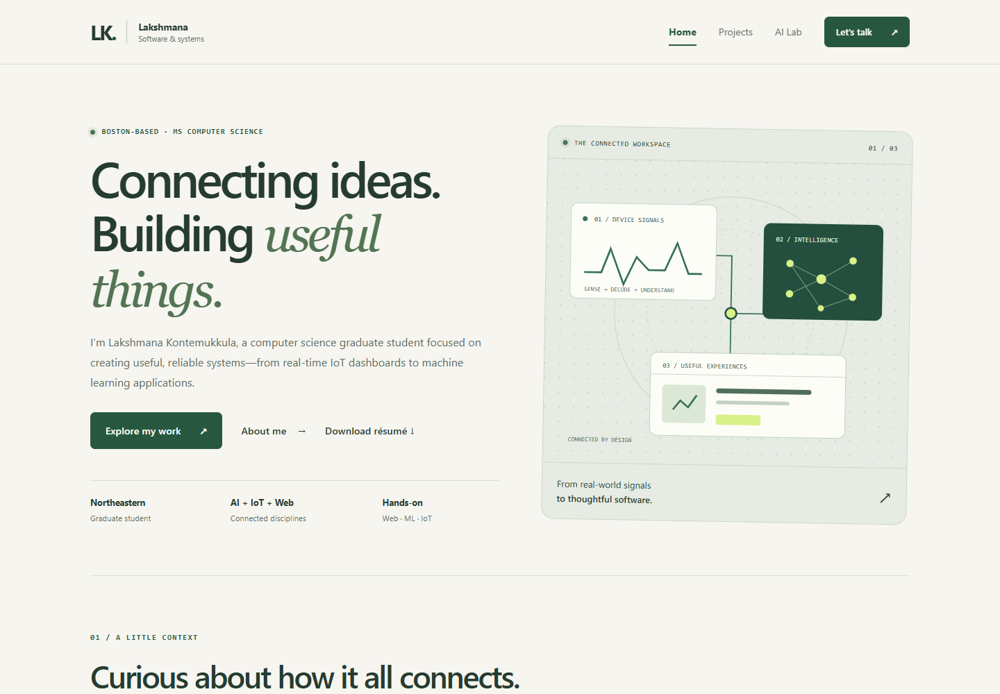

# Connected by Design — Lakshmana Kontemukkula

A responsive personal portfolio homepage built with **vanilla HTML5, CSS3, and ES6+**. The site presents my background, selected projects, and an interactive Project Explorer without using a front-end framework or component library.

## Author

**[Lakshmana Kontemukkula — portfolio homepage](./index.html)**  
MS in Computer Science, Northeastern University · Expected May 2027

[LinkedIn](https://linkedin.com/in/lakshmana-k-785727291) · [Email](mailto:lakshmana.2003k@gmail.com) · [Résumé PDF](./docs/lakshmana-resume.pdf)

## Class Link

`https://johnguerra.co/classes/webDevelopment_online_fall_2026/`

## Project Objective

The goal of this project is to create a meaningful public homepage that introduces who I am, demonstrates my technical interests, and gives visitors an easy way to explore representative work. The implementation uses semantic HTML, organized CSS, and native ES6 modules.

## Live Site

After GitHub Pages deployment, replace this with the public URL:

`https://lakshmana2003k-afk.github.io/Homepage-Lakshmana/`

## Screenshot



## Features

- Responsive homepage with meaningful biography and project content
- Original **Project Explorer** that filters projects by category and updates an `aria-live` summary
- Original **Project Spotlight** interaction written in vanilla JavaScript
- Scroll-reveal interaction using `IntersectionObserver`
- Responsive mobile navigation
- Separate project case-study page
- Résumé-backed education, three internships, skills, LinkedIn/email contact, and a downloadable résumé
- Eight filterable projects, including traffic-control reinforcement learning, water/food monitoring, and an NLP recommender
- Third AI-assisted concept page with an interactive energy-to-task selector
- Editorial typography, local PNG illustrations, project jump links, and illustrated project cards
- Navigation and core content remain usable without JavaScript; reduced motion is respected
- Semantic HTML, keyboard-focusable controls, alt text, and a skip link
- No jQuery, Bootstrap, React, or other UI/component library

## Pages

- `index.html` — main portfolio homepage
- `projects.html` — project case studies
- `ai-lab.html` — AI-assisted third page / concept prototype

## Project Structure

```text
homepage_assignment/
├── index.html
├── projects.html
├── ai-lab.html
├── css/
│   └── styles.css
├── js/
│   └── main.js
├── images/
│   ├── edge-ai.png
│   ├── favicon.png
│   ├── food-quality.png
│   ├── hero-illustration.png
│   ├── homepage-screenshot.png
│   ├── iot-dashboard.png
│   ├── ml-evaluation.png
│   ├── mockup-desktop.png
│   ├── mockup-lab-desktop.png
│   ├── mockup-lab-mobile.png
│   ├── mockup-mobile.png
│   ├── mockup-projects-desktop.png
│   ├── mockup-projects-mobile.png
│   ├── traffic-control.png
│   └── web-system.png
├── docs/
│   ├── design-document.md
│   └── lakshmana-resume.pdf
├── .gitignore
├── .prettierignore
├── .prettierrc
├── eslint.config.js
├── package.json
├── LICENSE
└── README.md
```

## Technical Requirements

- A modern browser with JavaScript modules, CSS Grid, and Flexbox support.
- A local HTTP server (VS Code Live Server or Python 3's built-in server).
- Node.js and npm for the declared Prettier/ESLint development tools. The website itself needs neither Node nor a backend once served.
- No build pipeline, API keys, external fonts, runtime packages, or component libraries.
- Development dependencies are listed in `package.json`. Do not replace the professor's `eslint.config.js`.

## Instructions to Build / Run

1. Install a current Node.js version.
2. Open the project folder in VS Code.
3. Run `npm install` in the VS Code terminal.
4. Run `npm run format` to apply Prettier.
5. Run `npm run format:check` to verify formatting.
6. Run `npm run lint` to run the class ESLint configuration.
7. Open `index.html` with the VS Code **Live Server** extension.

### Use the site

1. Open the homepage, browse experience and education, or download the résumé.
2. In Project Explorer, select All, IoT, Machine Learning, or Web to filter eight projects.
3. Follow a case-study link, or use the project index on the Projects page.
4. Select “Show another project” to cycle through the original four Spotlight lessons.
5. Open AI Lab and choose an energy level to highlight a matching sample task.
6. On a phone, use Menu; with a keyboard, use Tab, Enter/Space, and Escape. A skip link leads to the main content.

For a Python server, run `python -m http.server 8000` from this folder and open
[the local homepage](http://localhost:8000). No compilation is needed.

## Formatting and Validation

- Format: `npm run format`
- Check formatting: `npm run format:check`
- JavaScript lint: `npm run lint`
- HTML validation: check `index.html`, `projects.html`, and `ai-lab.html` using the W3C validator before final submission.

## ESLint

This project uses the **class-provided `eslint.config.js`**. It includes the ESLint recommended rules, browser/Node/ES2025 globals, two-space indentation, Unix line endings, double quotes, semicolons, and Prettier integration.

## Creative / Original Component

The homepage includes an original **Project Explorer** written in ES6+. Visitors can choose All, IoT, Machine Learning, or Web. JavaScript reads each project's `data-category`, hides non-matching cards, tracks how many projects remain visible, changes the active filter, and updates an `aria-live` summary.

A second interaction called **Project Spotlight** cycles through project lessons without reloading the page.

## GenAI Use

I used ChatGPT-5.6 Sol to get ideas. It helped me brainstorm the website structure, guided me on how to improve improve the visual design, organize parts of the HTML/CSS, review JavaScript functionality, and check the project against the assignment rubric.

Prompts included:

- “Suggest an original JavaScript feature for my portfolio.”
- “Check whether my project satisfies this assignment rubric.”
- “Give me an idea on how to improve the design of my portfolio homepage.”

I reviewed and tested the suggestions myself. The third page, `ai-lab.html`, is the AI-assisted page required by the assignment.

## Deployment

Recommended: GitHub Pages.

1. Push this project to a GitHub repository.
2. Open **Settings → Pages** in the repository.
3. Under **Build and deployment**, choose **Deploy from a branch**.
4. Select the `main` branch and `/ (root)` folder.
5. Save and open the public GitHub Pages URL after deployment.
6. Add that URL to this README and to the course submission form.

## Video Demo

Record a short public or unlisted narrated video demonstrating the homepage, Project Explorer, responsive layout, Projects page, and AI-assisted third page.

Replace this before submission:

`PASTE_PUBLIC_VIDEO_URL_HERE`

## License

This project is licensed under the MIT License. See `LICENSE`.

