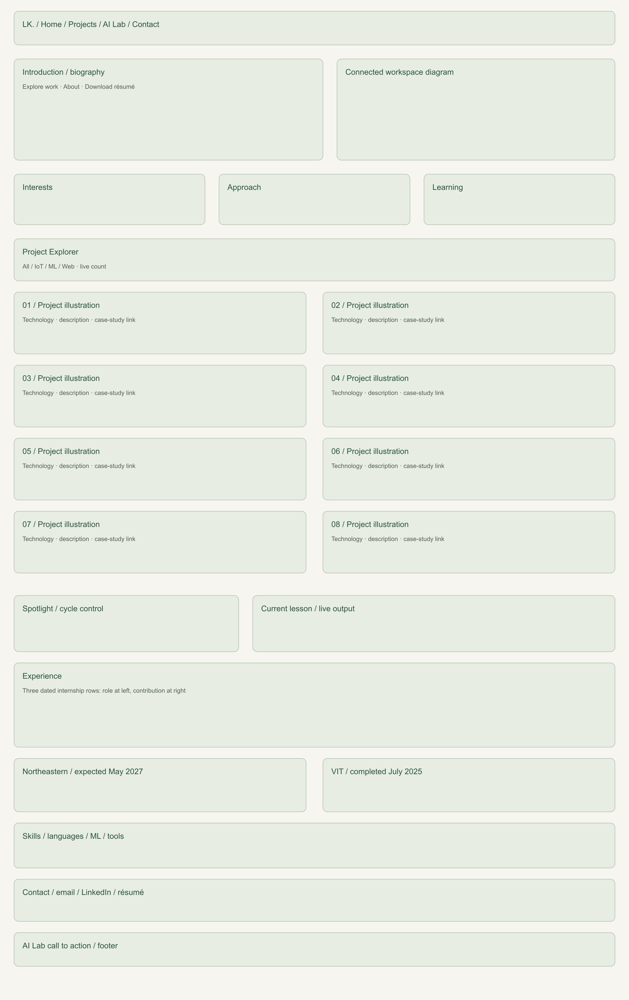
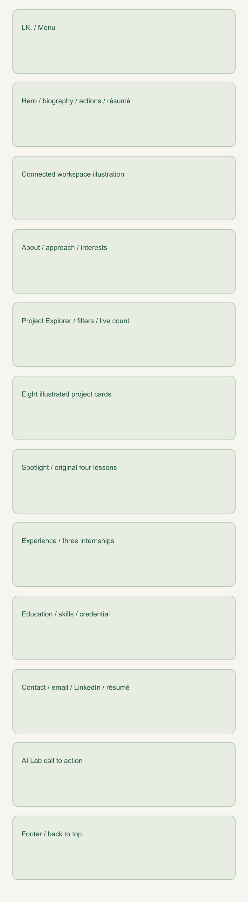
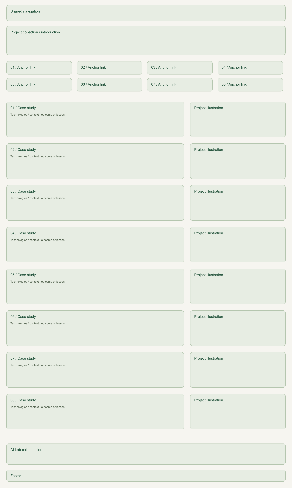
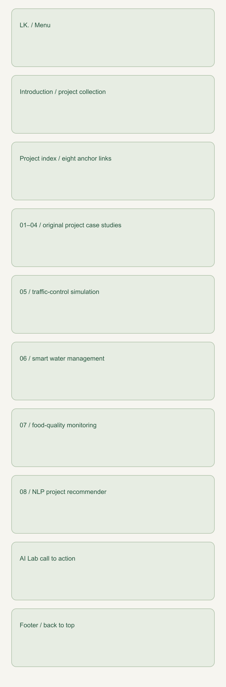
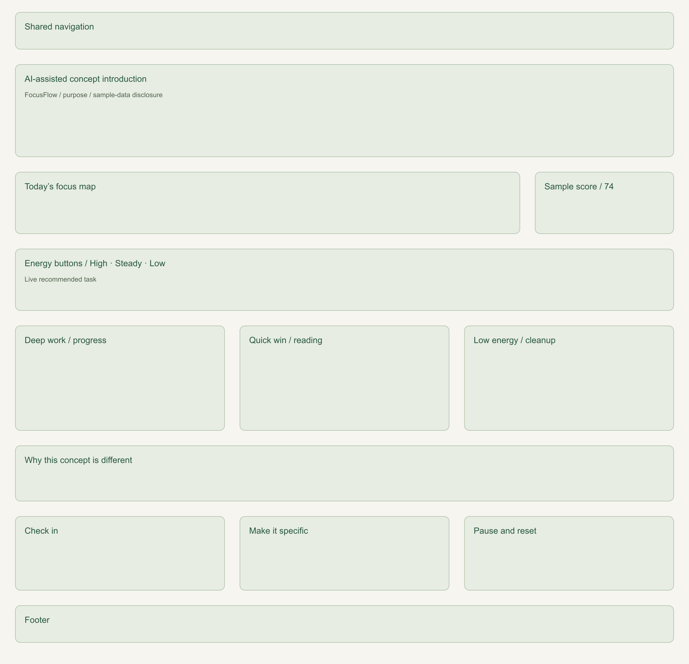
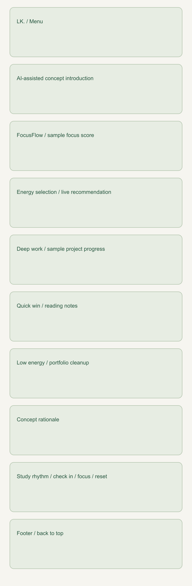

# Design Document — Lakshmana Kontemukkula Portfolio

## 1. Project Description

The project is a responsive personal homepage for Lakshmana Kontemukkula, an MS in Computer Science student at Northeastern University. The site introduces his interests in web development, machine learning, and IoT, presents representative project work, and gives visitors an interactive way to explore projects by category.

The site is intentionally implemented with vanilla HTML5, CSS3, and ES6+ modules. It does not use a back end, jQuery, Bootstrap, React, or any other component library.

### Goals

- Give a visitor a clear introduction within the first screen.
- Highlight technical interests and representative projects.
- Provide a simple, responsive experience on desktop and mobile.
- Demonstrate original JavaScript interaction using ES6+.
- Keep the visual design consistent across multiple pages.
- Meet accessibility and semantic HTML expectations.

## 2. Target Users / Personas

### Persona 1 — Technical Recruiter

**Name:** Maya

**Context:** Maya is reviewing candidates for a software engineering internship. She has limited time and wants to quickly understand a student's background and strongest projects.

**Needs:**

- A short introduction that explains the student's focus.
- Scannable project descriptions.
- A simple way to move between the homepage and project details.
- A professional page that works well on a laptop or phone.

### Persona 2 — Classmate / Collaborator

**Name:** Daniel

**Context:** Daniel is another computer science student looking for a teammate for a class project. He wants to understand Lakshmana's technical interests and prior project experience.

**Needs:**

- Clear categories such as Web, ML, and IoT.
- Enough project context to identify overlapping interests.
- An easy contact option.

### Persona 3 — Instructor / Reviewer

**Name:** Professor Lee

**Context:** Professor Lee is grading the homepage assignment and needs to verify implementation requirements quickly.

**Needs:**

- Multiple working HTML pages.
- Semantic HTML and organized project files.
- Visible original functionality.
- A clearly documented AI-generated third page.
- A README that explains how the project was built and tested.

## 3. User Stories

1. **As a recruiter**, I want to understand who Lakshmana is within a few seconds so that I can decide whether to explore his work further.
2. **As a visitor interested in IoT**, I want to filter the project list to IoT projects so that I do not have to scan unrelated work.
3. **As a classmate**, I want to open a project details page so that I can understand the lessons and technologies behind a project.
4. **As a mobile visitor**, I want navigation and content to reflow cleanly so that I can use the site without horizontal scrolling.
5. **As an instructor**, I want to see an original JavaScript feature so that I can verify the student used ES6+ beyond a trivial script.
6. **As an instructor**, I want to see a separate AI-assisted page and an AI disclosure so that the use of generative AI is transparent.

## 4. Information Architecture

### Homepage (`index.html`)

- Navigation
- Hero / introduction
- About section
- Project Explorer
- Project Spotlight
- Internship experience
- Education, skills, and certification
- Email, LinkedIn, and résumé download
- Call to action to AI-assisted third page
- Footer

### Projects (`projects.html`)

- Navigation
- Projects introduction
- Eight project case studies, including four additions from the supplied résumé
- Link to AI-assisted page
- Footer

### AI Lab (`ai-lab.html`)

- Navigation
- Explanation that the page is AI-assisted
- FocusFlow speculative interface concept
- Three-step study rhythm: check in, make it specific, pause and reset
- Footer

## 5. Design Direction

The revised direction uses warm paper (#f6f5f0), forest green (#285740), quiet sage panels, restrained borders, and generous whitespace. Native Segoe UI/Arial typography pairs with italic Georgia headings. All fonts are local system fallbacks; no font service or component library is needed.

### Design Decisions

- **Warm neutral background:** keeps long project descriptions comfortable to scan.
- **Forest green accent:** unifies navigation, active filters, calls to action, tags, and illustrations.
- **Cards:** group related content without introducing non-standard HTML elements.
- **Large hero typography:** communicates the portfolio focus immediately.
- **Responsive grid/flex layouts:** keep the page usable at laptop, tablet, and phone sizes.
- **Visible focus states:** support keyboard navigation.
- **Reduced-motion support:** avoids unnecessary animation for users who prefer reduced motion.

## 6. Mockups

### Desktop Mockup

The desktop layout uses two hero columns, three-column information cards, and a balanced two-column grid of eight illustrated project cards. The case-study page adds a eight-item project index. The AI page groups three energy-based tasks inside one workspace.

### Mobile Mockup

The mobile layout collapses the hero and grids into a single-column flow and uses a menu button for navigation.

### Projects page wireframes

The project index links to eight semantic articles. Each contains technologies, context,
an outcome or lesson, and an illustration. The mobile flow places text before artwork.

### AI Lab wireframes

The FocusFlow concept groups an introduction, sample focus score, energy selector,
live recommendation, three task panels, and practical study-rhythm guidance. All tasks remain
visible when a recommendation changes. No personal data is stored.

## 7. Original Component

The **Project Explorer** is the primary original component. It uses buttons to filter project cards by category. JavaScript reads each card's `data-category`, toggles its visibility, updates the active filter style, counts visible projects, and updates a live text summary for accessibility.

A second JavaScript interaction, **Project Spotlight**, cycles through short project lessons without reloading the page and shows the current position. **FocusFlow** additionally matches high, steady, or low energy to a sample task, marks the chosen button with `aria-pressed`, highlights the recommendation, and announces it through a live region. Its score and progress are illustrative, not measured or saved.

## 8. Accessibility Considerations

- Semantic `header`, `nav`, `main`, `section`, `article`, and `footer` elements.
- Skip link for keyboard users.
- `aria-expanded` and `aria-controls` on the mobile navigation button.
- `aria-live` on dynamic filter and spotlight output.
- Descriptive alternative text for content images.
- Visible keyboard focus styles.
- Respect for `prefers-reduced-motion`.
- Standard `button` elements for interactive controls.

## 9. Technical Constraints

- Front-end only.
- Vanilla HTML5, CSS3, and ES6+.
- JavaScript loaded through `<script type="module">`.
- `"type": "module"` in `package.json`.
- No jQuery.
- No UI/component framework.
- CSS, JavaScript, images, and documentation in separate folders.

## 10. Redesign interaction and responsive details

- Current-page links use `aria-current="page"`; category and energy controls expose pressed states.
- Mobile navigation is progressively enhanced: links are visible without script. With script, the menu supports Escape with focus return, link selection, outside click, and breakpoint changes.
- The skip link moves keyboard focus to the main region; anchored case studies account for the sticky header.
- Content is visible before JavaScript runs. Reduced-motion preferences disable reveals and hover movement.
- Project images have explicit dimensions, useful alt text, and lazy loading below the first screen.
- At 760px the hero stacks and navigation switches to a menu. At 480px project and concept grids become one column.
- The original assignment constraints and project content remain in place; no achievements or performance metrics were invented.
- Screenshots and automated results are recorded in `validation-report.md`. Human review and assistive-technology testing remain valuable before submission.

## 11. Additional user stories and acceptance criteria

| Visitor story                                                                                               | Acceptance criteria                                                                                                      |
| ----------------------------------------------------------------------------------------------------------- | ------------------------------------------------------------------------------------------------------------------------ |
| As a recruiter, I want to review education and internships so I can understand the candidate's preparation. | Two education entries and three dated internships are visible on the homepage.                                           |
| As a recruiter, I want a résumé and contact links so I can follow up.                                       | Résumé download, email, and LinkedIn are reachable with the keyboard.                                                    |
| As an ML collaborator, I want the traffic-control result in context so I can understand its limits.         | The case study names the two-author team, six policies, 20 evaluation episodes, and simulation scope.                    |
| As a keyboard user, I want predictable controls so I can explore without a mouse.                           | Filters announce their selected state; the mobile menu closes with Escape and returns focus.                             |
| As an instructor, I want evidence for each rubric item so I can review the submission efficiently.          | README links to the design document, validation report, and rubric audit; unfinished external requirements are explicit. |

## 12. Content provenance

Education, internship dates, skills, the additional four projects, and updated contact links
come from the résumé supplied on September 25. The résumé PDF is included unchanged.
The original four case studies remain from the initial assignment, even where not listed
in the newer résumé. Portfolio illustrations are conceptual diagrams, not screenshots of
those projects. Grades are shown as supplied, without inventing grading scales. The master's
completion date is explicitly marked expected. The student must verify all personal claims.
